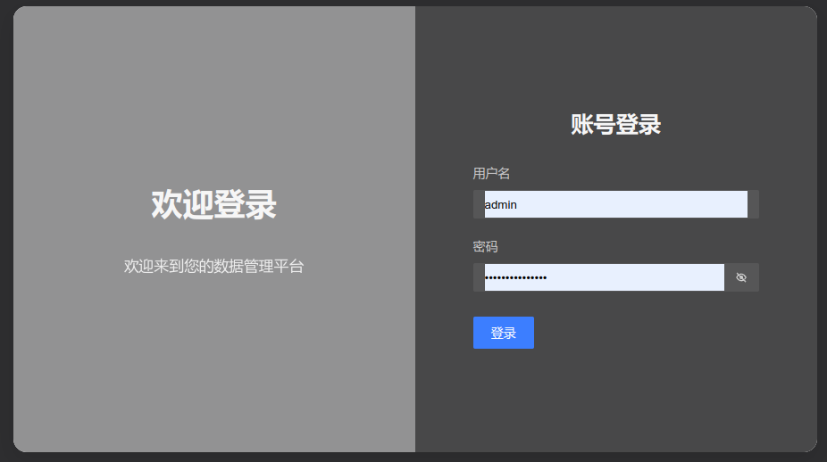
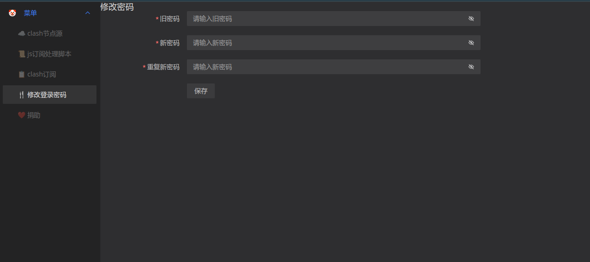
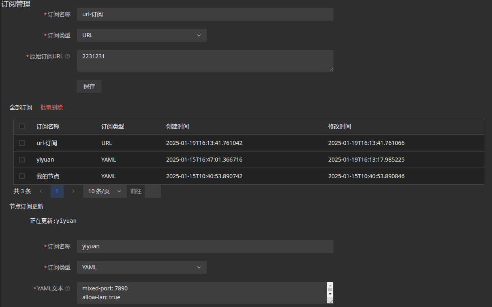
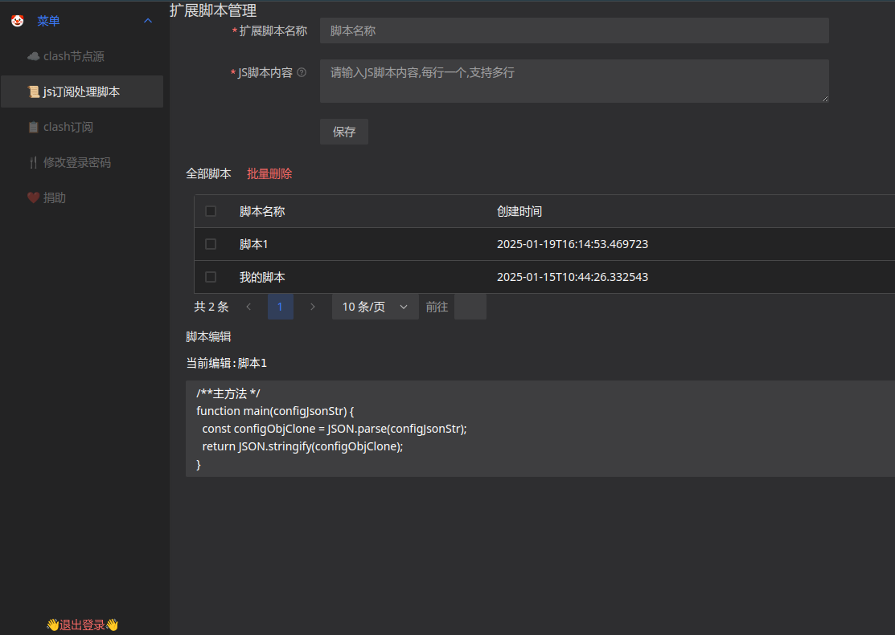
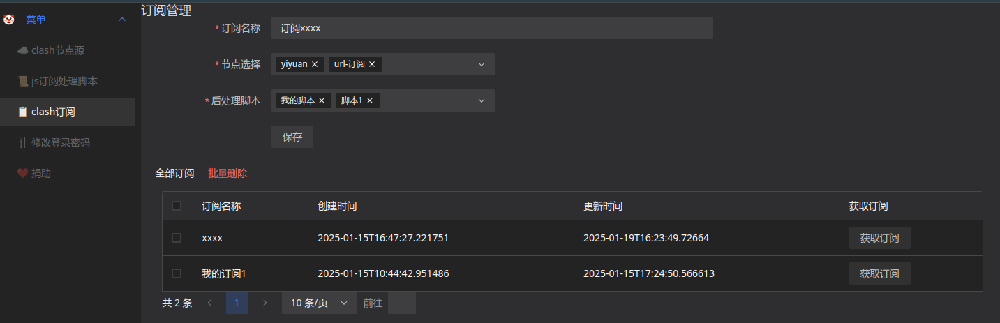

# clash 订阅工具

## 原理

订阅链接解析为clash配置文件，然后通过js脚本处理可以实现自定义分组规则等。

clash订阅1,clash订阅2 -> 合并订阅 -> 处理脚本1,处理脚本2 -> 新的订阅


## 部署方式
本项目使用docker发布，详细部署方式请查看[docker-compose.yml](./docker-compose.yml) 文件。

可以本地部署内网使用，注意发布到公网需要部署nginx配置好nginx证书保证没有中间人攻击。

## JS脚本格式

````javascript
/**主方法 */
function main(configJsonStr) {
  const configObjClone = JSON.parse(configJsonStr);
  //对configObjClone进行修改
    configObjClone.rules = [
        'GEOIP,CN,DIRECT'
        // ...
    ]
  return JSON.stringify(configObjClone);
}
````

## 系统截图
登陆页面 默认 admin/123456

修改密码

节点来源管理

脚本管理

订阅管理
