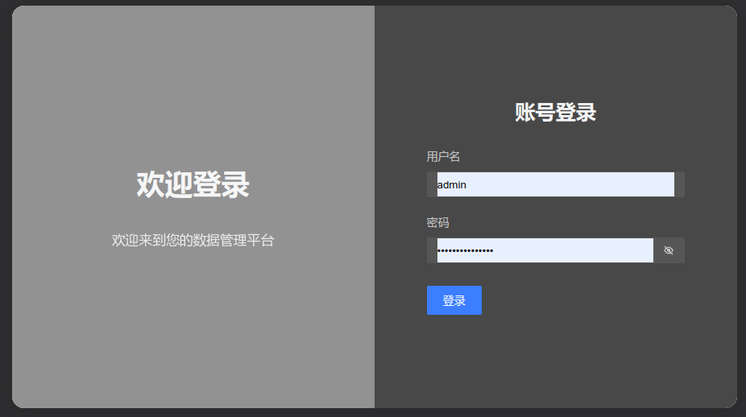
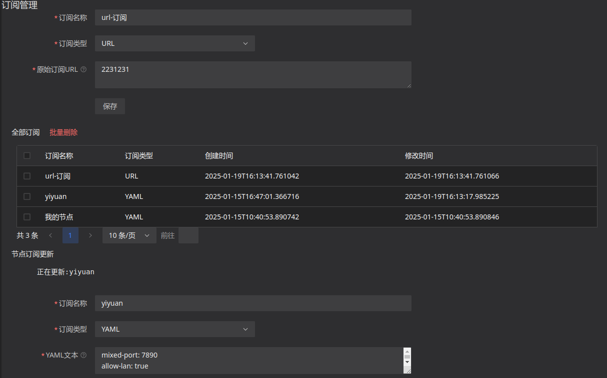
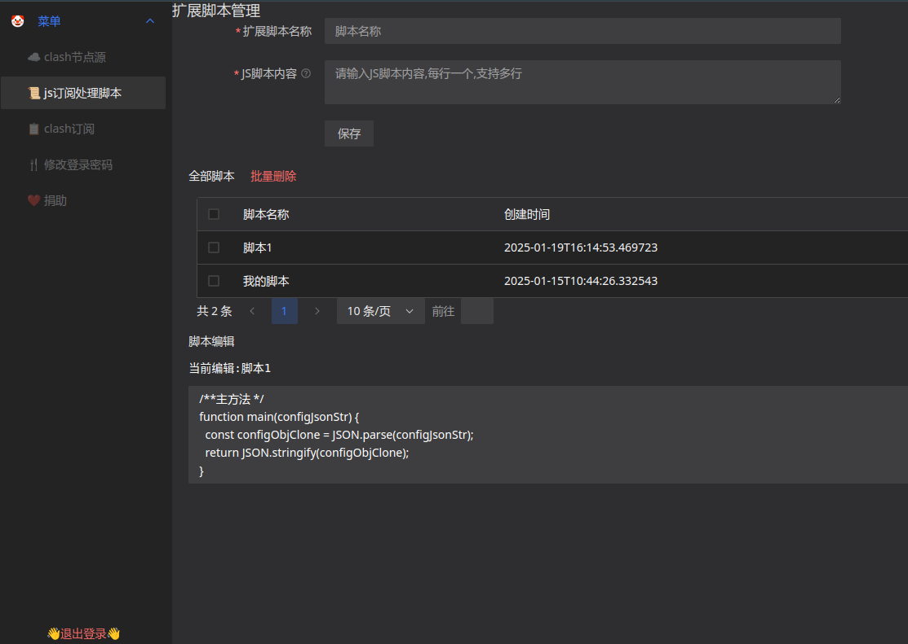
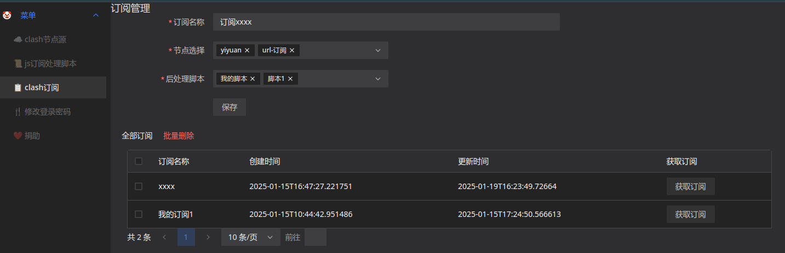
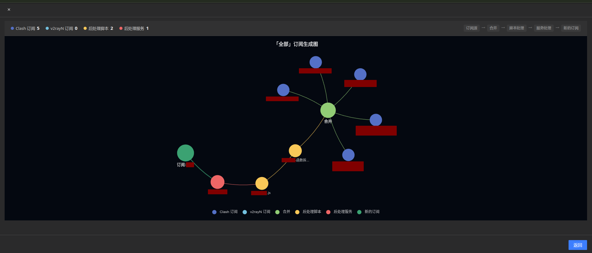
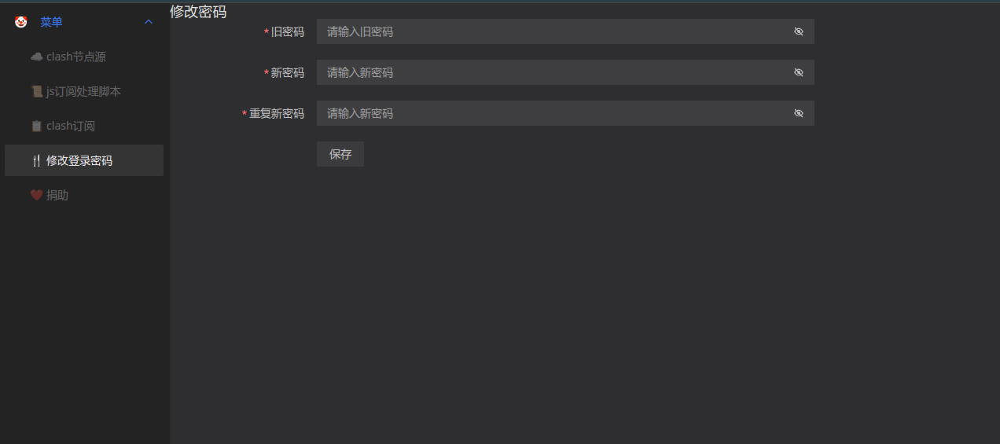

# 🚀 ClashSub Tools - 代理订阅管理与转换工具

<div align="center">


**一款轻量、极致高性能的 Clash / V2Ray 多协议订阅聚合、过滤转换与集中管理工具。**

[更新日志](ReleaseNote.md) · [快速开始](#-快速部署) · [JS 脚本说明](#-js-脚本引擎与扩展) · [系统截图](#-系统截图)

</div>

---

## 🌟 核心特性

- ⚡ **极致性能后端**: 基于 **Rust + Axum + Tokio** 异步框架重构，毫秒级响应，内存占用极低（相比传统 JVM 方案大幅降低资源消耗）。
- 🎨 **现代化 UI 体验**: 采用 **Vue 3 + Vite + Ant Design Vue 4** 开发，支持**暗色/亮色主题切换**与优雅的**玻璃拟态 (Glassmorphism)** 视觉风格。
- 📊 **可视化数据大盘 & 路径图**: 登录即见节点、脚本、订阅统计看板，支持**可视化流程图**清晰展示订阅来源与处理路径。
- 🧩 **强大 JavaScript 处理引擎**: 内置 **QuickJS (rquickjs)** 脚本引擎，支持通过自定义 JS 脚本对节点进行灵活过滤、重命名、去重以及动态规则与策略组注入。
- 🌐 **多协议与客户端深度兼容**: 
  - 支持 Shadowsocks, VMess, VLESS, Trojan, Hysteria/Hysteria2 等主流代理协议。
  - 自动识别 Clash、V2RayN 等客户端 UA，自适应输出最适配的配置格式。
- ⏱️ **节点测速与超时剔除**: 可选搭配轻量级测速组件（`clash-speedtest`），自动检测并剔除失效/超时节点。
- 🔒 **工业级安全机制**: 采用 Argon2 密码哈希与 ES256 椭圆曲线 JWT 签名，有效防止暴力破解与 Token 伪造。
- 💾 **轻量存储持久化**: 内置 SQLite 存储，单文件持久化，告别繁重外部数据库依赖，即开即用。

---

## 🔄 处理原理与流程

```
┌─────────────────┐
│ 节点来源 (Clash) │────┐
└─────────────────┘    │
┌─────────────────┐    ├─► [ 订阅合并/去重 ] ──► [ QuickJS 脚本处理 ] ──► [ 节点测速过滤 ] ──► [ 生成最终订阅 ]
│ 节点来源 (V2Ray) │────┤                           (自定义规则/分组/重命名)      (可选 speedtest)        (Clash / V2Ray)
└─────────────────┘    │
┌─────────────────┐    │
│  自建单节点/链接 │────┘
└─────────────────┘
```

### 💡 典型应用场景
1. **多订阅合并**: 将多个服务商的 Clash / V2Ray 订阅聚合为一个统一订阅，方便在多设备间同步。
2. **多端配置统合**: 手机、电脑、软路由全平台使用统一的订阅地址与分流规则，一处配置、全端生效。
3. **节点清洗与重命名**: 批量过滤广告节点、按国家/地区/倍率格式化节点名称。
4. **自定义分流规则与策略组**: 注入自定义 Direct、Proxy、Reject 规则与自定义策略组，摆脱服务商预设规则限制。

---

## 🛠️ 技术栈

| 层次 | 核心技术 | 作用说明 |
|:---|:---|:---|
| **后端框架** | Rust + Axum 0.7 + Tokio 1 | 高性能异步 HTTP 核心服务 |
| **持久层** | SeaORM + SQLite | 轻量、嵌入式、免运维的单文件数据库持久化 |
| **JS 引擎** | rquickjs 0.8 (QuickJS) | 轻量快速的嵌入式 JavaScript 执行沙盒 |
| **前端体系** | Vue 3 + TypeScript + Vite | 现代化响应式单页面应用 (SPA) |
| **UI 组件库** | Ant Design Vue 4 | 现代化企业级 UI 设计语言 |
| **认证安全** | Argon2 + jsonwebtoken (ES256) | 工业级密码哈希与安全 Token 鉴权 |

---

## 🚀 快速部署

本项目提供预构建 Docker 镜像，只需几步即可快速完成部署。

### 1. 准备工作并启动服务

```bash
# 克隆仓库
git clone https://github.com/dev2people/clashsub-tools-server-docker-compose.git
cd clashsub-tools-server-docker-compose

# 启动容器
docker-compose up -d
```

### 2. 访问控制台

- **访问地址**: `http://<服务器IP或127.0.0.1>:29081`
- **默认管理员账号**: `admin`
- **默认管理员密码**: `123456`

> ⚠️ **安全建议**: 首次登录后，请立即进入 **修改密码** 页面更改默认密码。

### 3. 反向代理与公网访问（可选）

如需发布到公网，强烈建议使用 **Nginx** 或 **Caddy** 配置 HTTPS / SSL 证书，防止传输过程中的明文截获或中间人攻击。

---

## 🔄 升级维护

当有新版本发布时，进入项目目录执行以下命令即可平滑升级：

```bash
cd clashsub-tools-server-docker-compose

# 拉取最新镜像并重启
docker-compose pull
docker-compose down
docker-compose up -d
```

---

## 📜 JS 脚本引擎与扩展

系统内置了 QuickJS 沙盒引擎，可编写 JavaScript 脚本对配置对象进行深度定制。

### 脚本入口规范
```javascript
/**
 * 转换主方法
 * @param {string} configJsonStr - 原始配置的 JSON 字符串
 * @returns {string} 处理完成后的 JSON 字符串
 */
function main(configJsonStr) {
    const config = JSON.parse(configJsonStr);

    // 1. 过滤或重命名节点
    if (Array.isArray(config.proxies)) {
        config.proxies = config.proxies.filter(node => !node.name.includes('过期'));
    }

    // 2. 自定义分流规则
    config.rules = [
        'DOMAIN-SUFFIX,google.com,PROXY',
        'GEOIP,CN,DIRECT',
        'MATCH,PROXY'
    ];

    return JSON.stringify(config);
}
```

系统内已预置多套常用规则和分组模板，可直接在 **脚本管理** 中一键导入或根据需求修改。

---

## 🖼️ 系统截图

| 登录界面 | 节点来源管理 |
|:---:|:---:|
|  |  |

| 脚本管理 | 订阅管理 |
|:---:|:---:|
|  |  |

| 订阅生成可视化路径 | 密码修改 |
|:---:|:---:|
|  |  |

---

## 📋 免责声明

1. 本项目仅供网络技术研究与个人学习使用，请遵守当地法律法规。
2. 请勿将本项目用于任何非法用途，使用者对使用过程中的一切行为自行承担责任。

---

## 📄 License

本项目采用 [MIT License](LICENSE) 开源协议。